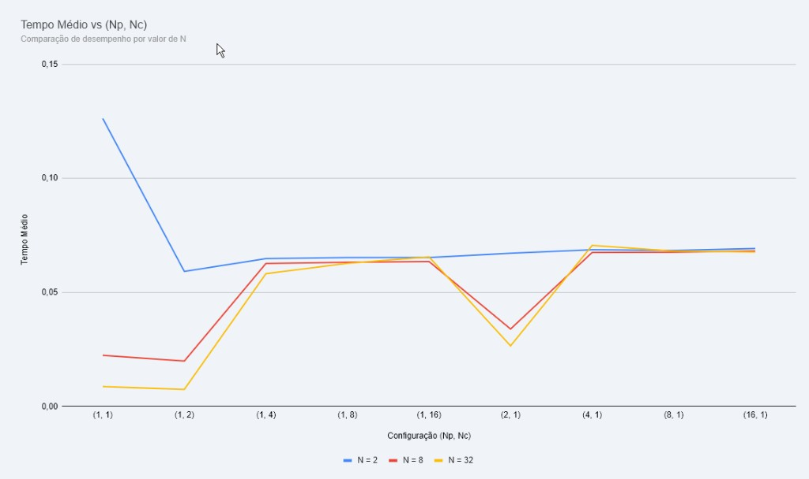

# Produtor-Consumidor

## Compilar

```bash
gcc -pthread -o produtor-consumidor produtor-consumidor.c
```

## Rodar

```bash
./produtor-consumidor <N> <Np> <Nc>
```

- `N` — tamanho do buffer
- `Np` — threads produtoras
- `Nc` — threads consumidoras

Exemplo:

```bash
./produtor-consumidor 32 1 2
```

## Resultados


# Problema-Produtor-Consumidor-com-Sem-foros
